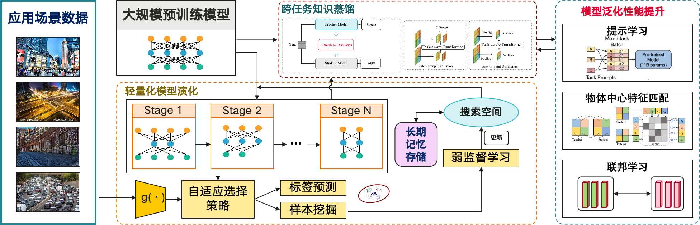

# Visual_Scene_Adaptive_Framework
This repo is the MindSpore implementation of Visual_Scene_Adaptive_Framework. 

The objective of this project is to enhance the practicality and generalization of large-scale visual pretraining models in various downstream application scenarios. By constructing adaptive and diversified network structures and learning methods, we aim to provide technical support and application demonstrations for building large-scale visual scene applications in open and complex environments. We explore the flexible adaptation capabilities of visual large-scale models to diverse downstream data in domains such as generalization in visual scenes [PDOC and FedGM], adaptive dynamic networks [PDOC], image restoration and enhancement [OutSampleRestoration and JCRNet], cross-task knowledge distillation [ProC-KD], and weakly supervised training [WS-VAD]. 

## 1. Illustration of the Large-scale Model-guided Visual Scene Adaptive Framework. 

    

First, a series of lightweight network structures are generated from an initial search space. These structures are adaptively selected based on the pre-judgment of the input scene to perform the complete inference process. The predicted results are applied to the current task, and representative samples are mined. The search space is updated through weakly supervised learning to increase the accuracy of structure selection for the given scene. Additionally, a long-term memory module selectively records changing scene visual information to avoid catastrophic forgetting. Furthermore, the large-scale model is distilled across tasks through prototype learning and hierarchical spatial feature extraction. Techniques such as cue learning, object-centric feature matching, and federated learning are employed to enhance the generalization performance of downstream tasks.

## 2 Paper

[**PDOC**]: **[Prompt-Driven Dynamic Object-Centric Learning for Single Domain Generalization](http://arxiv.org/abs/2402.18447)** (CVPR 2024)
[**OutSampleRestoration**]: **[Generalizing to Out-of-Sample Degradations via Model Reprogramming](https://scholar.google.com.hk/citations?hl=zh-CN&user=mD3lO60AAAAJ&view_op=list_works&sortby=pubdate)** (IEEE TIP)
[**FedGM**]: **[Multi-Source Collaborative Gradient Discrepancy Minimization for Federated Domain Generalization](https://arxiv.org/abs/2401.10272)** (AAAI 2024)
[**WS-VAD**]: **[Weakly-Supervised Video Anomaly Detection with Snippet Anomalous Attention](https://ieeexplore.ieee.org/document/10381822)** (IEEE TCSVT)
[**JCRNet**]: **[Joint Correcting and Refinement for Balanced Low-Light Image Enhancement](https://ieeexplore.ieee.org/document/10376299)** (IEEE TMM)

## 3 Dependencies

	Python: 3.8.10
	MindSpore: 2.1.1
	Pillow: 9.5.0
	NumPy: 1.22.4
	PIL: 7.2.0

## Acknowledgments
This Project is supported by the CAAI-Huawei MindSpore Open Fund. The code is built on [Mindspore](https://www.mindspore.cn/).